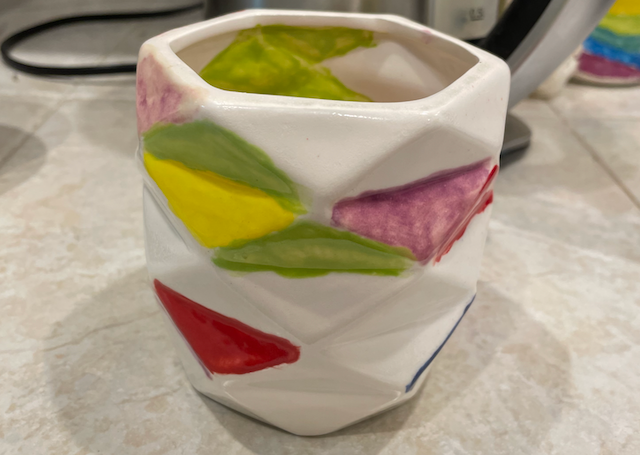
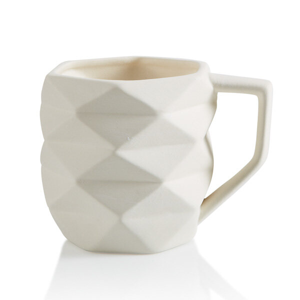

# Prisma Maze

This project is about to draw a maze on a prisma patten mug.

## The Beginning

In 2020, while my family with two kids stay home, many activities changed. One of them is drawing pottery. We used to visit [Paint Away](https://paintawaynow.com/) once per a few months, pick potteries for everyone in our family, and paint it there. They usually can only be brought back, and draw at home since this summer.

Although it's more inconvenient to draw at home than in-store, we have more time to design the images, which results in more complicated designs.

This summer, I picked a prisma mug and thought I might design a more complicated pattern.

In my eyes, this mug is a grid, which each cell is triangle shaped. I got two ideas while planning. I can draw pixel art on it (I was thinking of the React logo) or draw a maze on the grid.

I checked with my kids. Both of them like the maze idea better. It also sounds more interesting to me. So that's the plan.

## Research

I'm a computer software engineer, not an architect in the movie [Inception](https://www.imdb.com/title/tt1375666/). I prefer to write a little code to automatically generate a maze instead of designing a maze on paper. Indeed, to implement a maze generator is the reason I think a maze mug is more interesting.

I didn't know any maze generation algorithm, so I did a little research, read a few [Wikipedia page about the maze generation algorithm](https://en.wikipedia.org/wiki/Maze_generation_algorithm). Among all the algorithms listed on the page, I prefer [Wilson's algorithm](https://en.wikipedia.org/wiki/Maze_generation_algorithm#Wilson.27s_algorithm), not only because the algorithm generates an unbiased result, but also the algorithm looks beautiful to me. So I decided to write Wilson's algorithm-based maze generator.

## Requirements

1. It should generate a maze that can be drawn on the Prisma mug side surface. The surface has its top and bottom boundaries but has no left or right edges. Continue horizontal navigation should get back to the starting point.
2. Since the mug has the same Prisma pattern inside, I decided to draw the answer on the cup's inside surface.
3. Every cell's color should be adjusted to its neighbor cells' colors.
   

## Problem

Like most of the maze generation algorithms, Wilson's algorithm uses the concept of space and walls. In the beginning, all the rooms are separated by the walls, then by erasing some walls, spaces are linked as paths, and generates a maze.

In the case of the mug, what are space and walls?

My initial idea is every single triangle cell is a space; its three borders are walls. But soon, I realized, my low paint skill cannot let me draw the fine details on such a level. I must use a whole-cell as either space or wall.

There are 5 X 12 cells on the mug. My first design is to set as many cells as possible to be spaces, which result in 30 space cells and 30 walls. Then, I found if I do this, after removing some of the walls, there would be only a few cells with color on the mug, and non of them would be connected. I should reduce the count of the space, so there would be more colored cells. Ideally, there should be a balance between the filled cells and the white cells.

I tried a few different patterns and finally decided to use 3 X 4 cells as spaces, all the other cells as walls.

## Code

This repository includes

- Data structure for the 3 X 4 cells grid for data, 5 X 12 cells grid for rendering, and the mappers to map the data grid to rendering grid.
- A Wilson's algorithm implementation on the 3 X 4 data grid.
- A short pathfinder algorithm implementation to find the answer.
- Algorithm to calculate color based on its neighbor cells' color.
- React components to render the maze and the answer

## Result

`npm start`

## What to improve

After I painted the mug, I realized the fixed initial spaces and walls might lead to redundant areas in the final result.

In my mind, the algorithm should treat all the cells as a concrete block and dig in it to create a path to another cell. After completing a route, calculate the ratio between the space and walls. And pick a new start point from the center of the concrete block. Repeat it till an expected rate is archived.

Another idea is to detect redundant spaces and fill in color to remove them.

Or maybe I can use these two approaches together.

Other improvements include:

- Implement more maze generation algorithms, which should be fun.
- Better UX, which also could be fun.

Last but not least, it took me time to write the code. I also took two weeks of vacation during it. When I was ready to paint the mug, it's already more than one month since I got the mug and the colors. Most of the colors had been dried, which makes it hard to paint. So if I'll repaint it, I'll first prepare my code, then grab the mug and colors.
